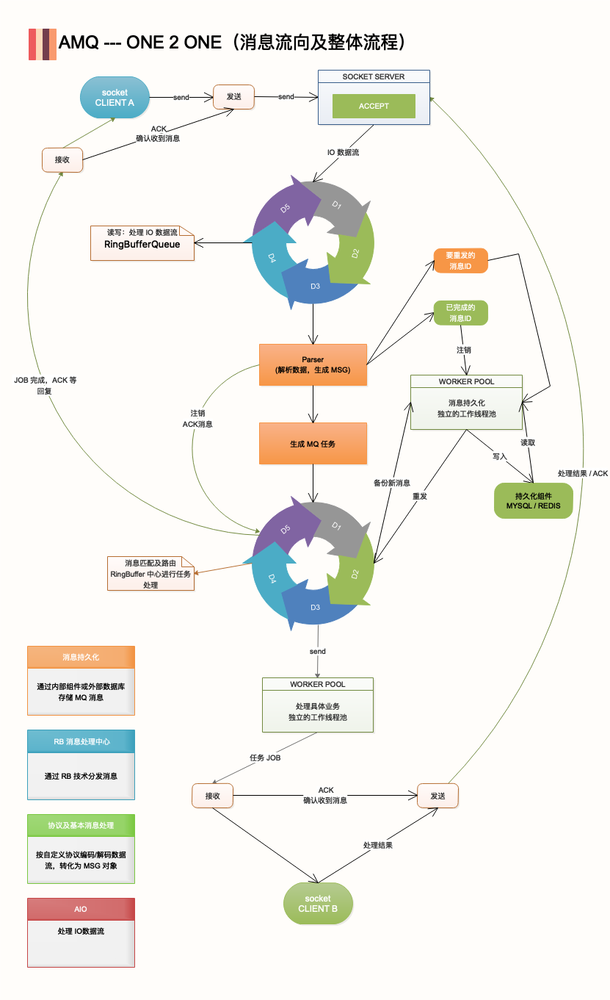

Artfii-MQ 简称(AMQ), 是一个极轻量化,依赖极度少的 MQ 消息系统.
使用方便,高性能,并且对硬件要求低,是它的特色.
1. 在追求小的同时,高性能也是必须的,消息的分派使用了 LMAX-Ringbuffer 技术以保证性能.
2. 默认情况下,发布的消息存活期为一天,以避免像 RocketMQ 那样产生大量过期无效的消息堆积.
3. 支持多个消费者签收后,才自动注销发布的消息(ALL-ACK),支持自定义消息存活周期(永久,ALL-ACK,闪存)
4. 所有消息默认情况下,接收成功后就会自动标记[已送达].
5. 客户未签收(NACK)的情况下,支持设置重发次数与重发的时间间隔.
6. 发送失败(消费者断连)的情况下,支持设置重发次数与重发的时间间隔.
7. 特色的 PING/PONG 消息模式,以支持类似 RPC 的功能调用,却无 RPC 强制偶合的缺点,性能也比 RPC 调用更好.(微服务的最佳伴侣)
8. 普通的(发布者/订阅者)模式则支持大批量,高并发的写日志模式的 IO 消息业务.
9. 自带流量监控及后台管理功能
10. 黑名单自动拒绝连接
11. 项目完成后,我才发现原来有个叫 MQTT 协议(物联网协议)的东东,一不小心本项目做成了它的实例.

# AMQ 的架构整体思路

1. 通过 AIO 处理 IO 数据流
2. 协议处理器转化 IO 数据流为 MSG 消息对象
3. 通过 RingBuffer 框架技术分发及处理消息任务
4. 持久化中心：接收保存消息

